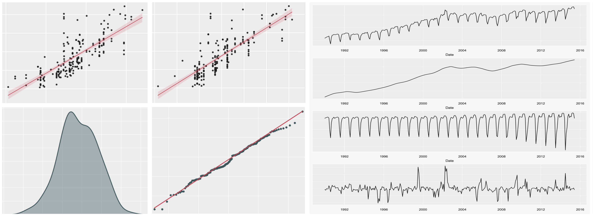
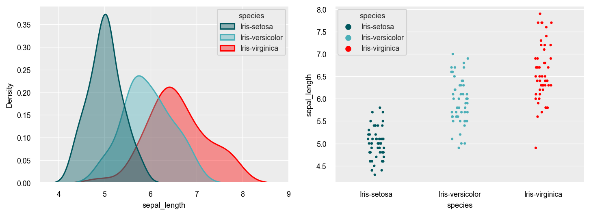
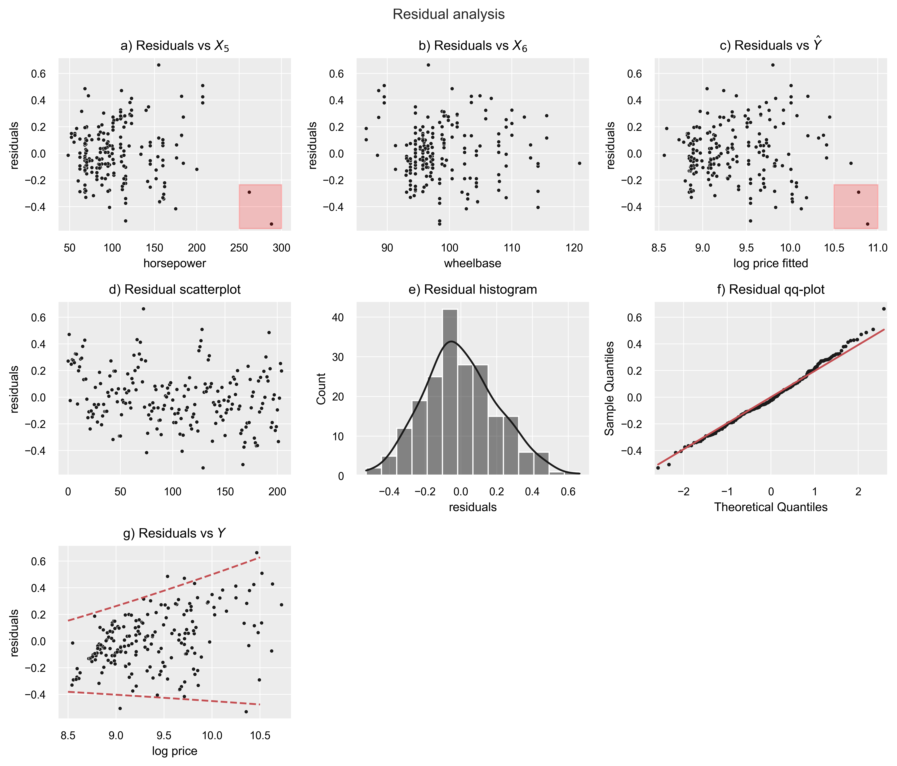
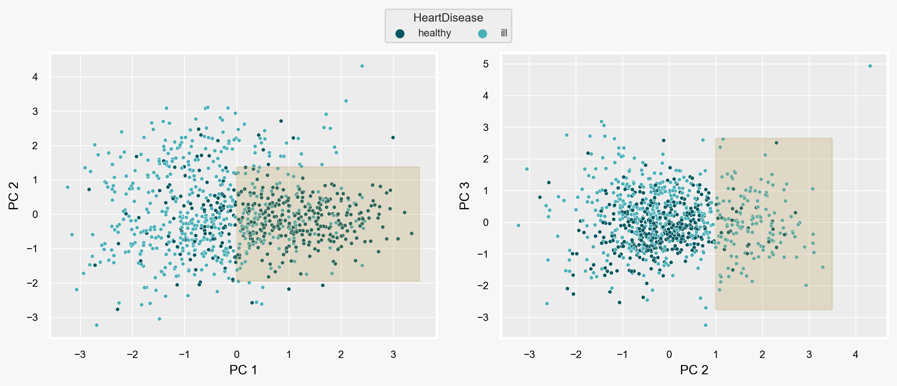
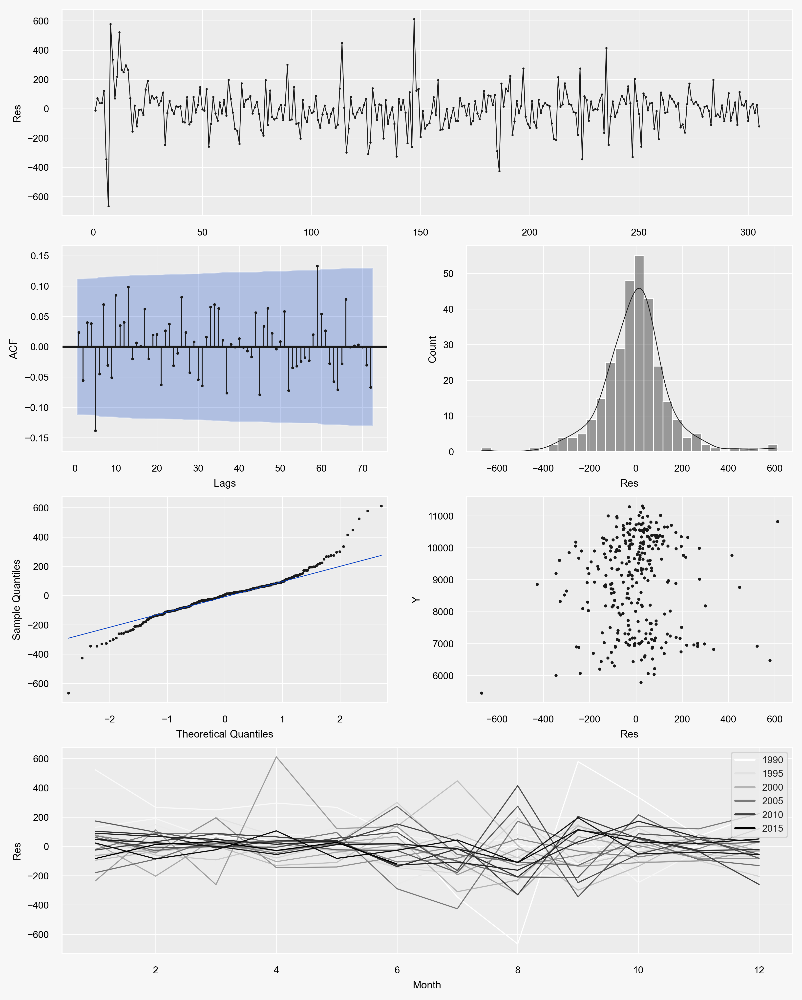

  <h1>Statistics & Econometrics & EDA</h1>
  
  

# Table of Contents

- [About the project](#s1)
  * [1. Goal](#s1.1)
  * [2. Data description](#s1.2)
- [Topics](#s2)
  * [1. Statistical tests](#s2.1)
  * [2. Regression analysis](#s2.2)
  * [3. PCA & Clustering](#s2.3)
  * [4. Time-series analysis](#s2.4)

# <a name="s1"/> About the project

## <a name="s1.1"/> 1. Goal

Cover a variety of interdisciplinary methods that can be applied in the domain of data science to obtain valuable insights.

## <a name="s1.2"/> 2. Data description

Each project contains references to all datasets that were used:

* [Heart failure dataset](https://www.kaggle.com/datasets/fedesoriano/heart-failure-prediction);
* [Car price dataset](https://www.kaggle.com/datasets/hellbuoy/car-price-prediction);
* [Iris flower dataset](https://en.wikipedia.org/wiki/Iris_flower_data_set).

# <a name="s2"/> Topics

## <a name="s2.1"/> 1. Statistical tests 

[View the code](./1_Scripts/Statistical_tests.ipynb)

This small project is dedicated to reviewing some commonplace statistical tests carried out with the help of Python:

* One-sample t-test, two-sample t-test (unpaired and paried), Welch’s t-test. This section also includes power analysis and the construction of confidence intervals;
* One- and two-way ANOVA with post-hoc tests;
* F-test, Levene’s test, Bartlett’s test.

## <a name="s2.2"/> 2. Regression analysis

[View the code](./1_Scripts/Regression_analysis.ipynb)

The following regression-related topics are covered in this section:

* Multicollinearity. How it can be quantified and detected with the help of $VIF$, $GVIF$, standard error analysis and $PCA$;
* Residual analysis. Assumptions and requirements formulated for both experimental and observational studies;
* Heteroskedasticity, normality and autocorrelation.

## <a name="s2.3"/> 3. PCA & Clustering

[View the code](./1_Scripts/PCA_clustering.ipynb)

In this section, a vareity of tools for conducting exploratory data analysis are presented:

* A number of useful visualisation techniques for in-depth EDA;
* Principal component analysis;
* Data clustering with the use of Gaussian mixture models and the k-means algorithm.

## <a name="s2.4"/> 4. Time-series analysis

[View the code](./1_Scripts/Forecasting.ipynb)

The final section discusses a commonly used – particularly in the field of econometrics – statistical method for forecasting, namely a regression with $ARIMA$ errors. The following topics pertaining to forecasting and time-series analysis are explored:

* Time-series decomposition;
* Mean encoding for time-series data;
* Automatically choosing the model’s parameters based on $AIC$;  
* Residual analysis;
* Addressing long and multiple seasonality.